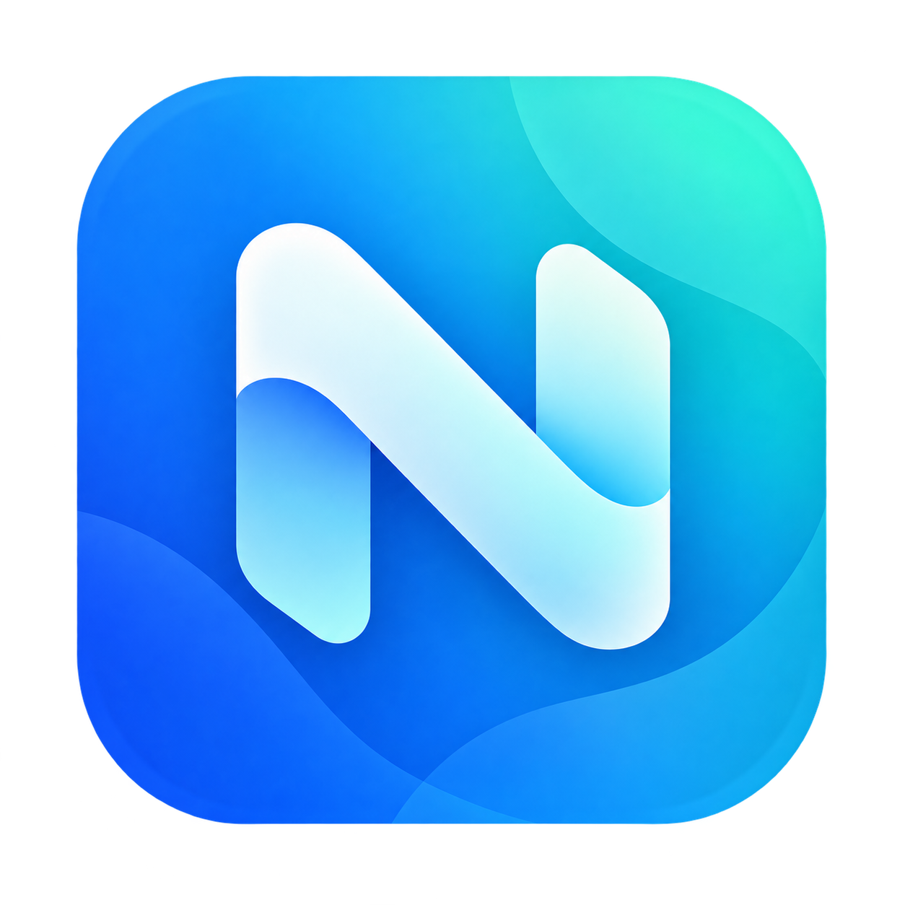

<div align="center">
  
  <h1>Nodalix OS</h1>
  <p><strong>A cohesive Arch Linux desktop built around Hyprland and QuickShell.</strong></p>

  <p>
    <a href="https://github.com/danielmigueltejedor/nodalix-os/releases/latest"></a>
    
    
    
    
  </p>

  <p>
    <a href="#installation">Installation</a> ·
    <a href="#the-nodalix-experience">Experience</a> ·
    <a href="#phone-link">Phone Link</a> ·
    <a href="#updates">Updates</a> ·
    <a href="#hardware-profile">Hardware</a> ·
    <a href="#architecture">Architecture</a> ·
    <a href="#support-and-contributions">Support</a>
  </p>
</div>

---

Nodalix is an Arch Linux desktop developed as one integrated system rather than a collection of unrelated dotfiles.

The shell, settings, application management, system updater, iPhone integration, visual identity, installation tools and release infrastructure are versioned and shipped together to provide a consistent desktop from first boot onwards.

> [!IMPORTANT]
> **`main` tracks active development for the next Nodalix release.**
> For normal installations, use a published release from [GitHub Releases](https://github.com/danielmigueltejedor/nodalix-os/releases).

## The Nodalix experience

| Desktop | System | Integration |
|---|---|---|
| Custom QuickShell interface | Arch Linux base | Integrated iPhone Phone Link |
| Hyprland on Wayland | Versioned Arch packages | System-wide update management |
| Cohesive controls and settings | Hardware-aware optimisation | Nodalix Apps |
| Consistent icons, typography and surfaces | Verified release manifests | Bluetooth, audio and network integration |
| Designed for keyboard and pointer use | Recovery paths kept available | Desktop notifications and media controls |

Nodalix is designed to feel like a complete operating system while retaining the flexibility and package ecosystem of Arch Linux.

## Core components

| Component | Purpose |
|---|---|
| **Nodalix Shell** | QuickShell-based desktop interface, panels, controls and system surfaces |
| **Nodalix Apps** | Management and integration layer for applications distributed or adapted for Nodalix |
| **Phone Link** | Native iPhone integration for notifications, contacts, messages and calls |
| **Nodalix Updater** | Release discovery, validation, installation and update-channel management |
| **Nodalix Release** | Version identity and definition of the core Nodalix system |
| **Nodalix Installer** | Installation flow for both the Nodalix ISO and supported Arch systems |
| **Nodalix Wallpapers** | Curated wallpapers and desktop visual assets |

## Phone Link

Nodalix includes its own iPhone integration instead of treating phone connectivity as a separate third-party application.

Phone Link currently combines several Bluetooth transports:

| Technology | Function |
|---|---|
| **ANCS over Bluetooth LE** | iPhone notifications |
| **MAP / OBEX** | Message access |
| **PBAP / OBEX** | Contacts |
| **HFP / oFono** | Call state and hands-free call control |

The connection manager tracks Bluetooth LE and BR/EDR independently. If the notification transport disappears while calls or classic Bluetooth remain connected, Nodalix can recover the LE bearer without unnecessarily tearing down the rest of the phone connection.

BlueZ preparation, ANCS recovery and the required address-resolution behaviour are managed by Nodalix system services rather than requiring manual Bluetooth configuration after installation.

## Installation

### Nodalix ISO — recommended for a fresh system

Download the latest Nodalix ISO from [GitHub Releases](https://github.com/danielmigueltejedor/nodalix-os/releases) and follow the [installation guide](./docs/iso.md).

The installer provides a Nodalix live environment and an Archinstall-based installation flow where the user selects and confirms the disk, language, encryption and account configuration before anything is written.

> [!NOTE]
> The current Nodalix ISO is not Secure Boot signed. Secure Boot must be disabled to boot the installation media. Custom keys can be configured after installation.

### Existing Arch Linux installation

Nodalix can also be installed on a supported, up-to-date Arch Linux system.

Download and inspect the installer first:

```bash
curl -fL https://raw.githubusercontent.com/danielmigueltejedor/nodalix-os/main/install.sh \
  -o /tmp/nodalix-install.sh

less /tmp/nodalix-install.sh
bash /tmp/nodalix-install.sh
```

The installer downloads the release manifest from GitHub, verifies package checksums, installs the required dependencies and performs the Nodalix package transaction.

## Updates

Nodalix includes a system updater instead of relying on manual release downloads.

Updates can be managed graphically from:

**Settings → Applications → Nodalix OS updates**

The update interface handles:

- Nodalix releases
- Stable and preview channels
- release notes and package contents
- Arch system updates
- user applications
- firmware updates
- automatic-update preferences
- restart requirements

The same backend is available from the terminal:

```bash
nodalix-updater check
sudo nodalix-updater update
sudo nodalix-updater channel beta
```

## Hardware profile

Nodalix detects the CPU capabilities of the target system and can select an appropriate CachyOS package tier.

Supported optimisation paths include:

- generic x86-64
- x86-64-v3
- x86-64-v4
- Zen 4 / Zen 5 through `cachyos-znver4`

Nodalix installs the matching optimised kernel where appropriate while preserving the standard Arch `linux` kernel and boot entry as a recovery option.

Virtual machines and unsupported or older processors remain on a compatible Arch configuration rather than forcing an optimisation profile.

The installer also prepares networking, audio, Bluetooth, display configuration and the login environment for the target machine.

## Release integrity

Nodalix releases are built as Arch packages and distributed with a versioned manifest.

Before installation, package metadata and SHA-256 hashes are validated against that manifest. The ISO build process also validates the Nodalix package set before embedding it into installation media.

Personal accounts, pairing information, credentials and machine-specific user settings are not included in release artifacts.

## Architecture

```text
┌─────────────────────────────────────────────────────────────┐
│                         Nodalix OS                          │
├───────────────────┬───────────────────┬─────────────────────┤
│   Nodalix Shell   │    Nodalix Apps   │     Phone Link      │
│                   │                   │                     │
│ QuickShell / QML  │ app management    │ ANCS · MAP · PBAP   │
│ controls          │ integration       │ HFP · Bluetooth     │
└─────────┬─────────┴─────────┬─────────┴──────────┬──────────┘
          │                   │                    │
          └──────────────┬────┴────────────────────┘
                         │
              ┌──────────▼──────────┐
              │   Nodalix services │
              │ updater · settings │
              │ hardware · system  │
              └──────────┬──────────┘
                         │
       ┌─────────────────▼──────────────────┐
       │      Hyprland · Wayland · Arch    │
       │   systemd · PipeWire · BlueZ      │
       └─────────────────┬──────────────────┘
                         │
                    Linux kernel
```

System-owned shell code is installed under:

```text
/etc/xdg/quickshell/nodalix/
```

and started through `nodalix-shell.service`.

User configuration and private pairing data remain in the user's XDG directories.

## Repository layout

| Path | Contents |
|---|---|
| `shell/` | Nodalix QuickShell desktop |
| `nodalix-apps/` | Application management and integration |
| `phone-link/` | iPhone integration and Bluetooth services |
| `updater/` | Release detection, validation and installation |
| `iso/` | Nodalix installation media |
| `packaging/` | Arch Linux package recipes |
| `release/` | Release manifests and component definitions |
| `tools/` | Package, ISO and release tooling |
| `tests/` | Update, migration, packaging and system regression tests |
| `docs/` | Installation and technical documentation |

## Release channels

| Channel | Version | Intended use |
|---|---|---|
| **Stable** | `X.Y.Z` | Recommended daily installation |
| **Beta** | `X.Y.Z-beta.N` | Preview testing |
| **Release candidate** | `X.Y.Z-rc.N` | Final release validation |
| **Development** | `main` | Work intended for the next release |

Stable releases and their artifacts are available from [GitHub Releases](https://github.com/danielmigueltejedor/nodalix-os/releases).

## Development

Clone the repository:

```bash
git clone https://github.com/danielmigueltejedor/nodalix-os.git
cd nodalix-os
```

The repository contains independent package sources as well as the tools required to assemble a complete Nodalix release.

Before submitting changes, keep modifications scoped to the relevant component and run the tests or validation tools associated with it.

## Support and contributions

- Use [GitHub Issues](https://github.com/danielmigueltejedor/nodalix-os/issues) for reproducible bugs and focused feature requests.
- Include your Nodalix version, relevant hardware and logs when reporting system-specific problems.
- For Bluetooth or Phone Link issues, include the affected transport or feature but **never publish pairing secrets or private phone data**.
- Keep pull requests focused on one component or problem where possible.
- Test installation, migration or hardware-profile changes in disposable environments before using them on important systems.

<div align="center">
  <sub>Designed and maintained by <a href="https://github.com/danielmigueltejedor">Daniel Miguel Tejedor</a>.</sub>
</div>
